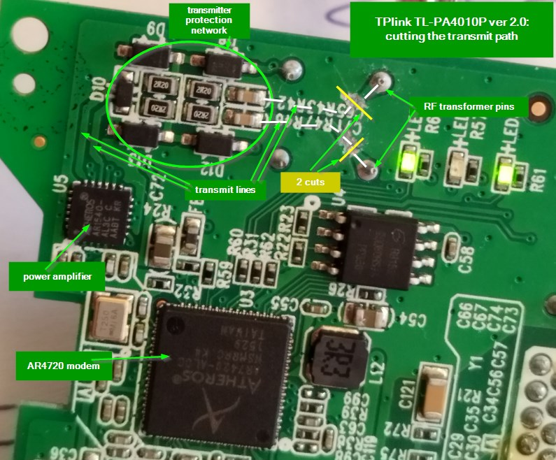

# Experiments for Sniffing

* Configuration of the sniffer device

## Q: Does it help or harm, to set the hfid different to "PEV", e.g. "PEV5E"?

* prepare a PIB with EVSE setting, but the following special setting: `pi@RPi3D:~ $ setpib pev5E.pib 74 hfid "PEV5E"`
* flash the PIB on a AR7420 modem
* try to run this as EV against an EVSE consisting of AR7420 and pyPLC
* result: works.
* conclusion: Having in the PEV an other HFID than "PEV" does not harm.

## Q: Which messages can be sniffed using the PEV configuration of an AR7420?

* Test setup:
    * EVSE using pyPLC and AR7420 on Raspberry.
    * PEV is Foccci (QCA7005)
    * Sniffer with AR7420, configured as PEV, with hfid "PEV5E". Win10, wireshark.
* Procedure:
    * start EVSE
* Observed:
    * wireshark shows the CM_SLAC_PARAM.CNF, CM_ATTEN_CHAR.IND and CM_SLAC_MATCH.CNF.
* Conclusion: Using a modem which is configured as PEV, we see only the SLAC messages of the EVSE.

## Q: Is it possible to join a network by extracting the NID and NMK from the slac_match.cnf?

* Test setup:
    * As above.
    * In pyPLC, set smart_listener_configuration = 1. This means, as soon as the pyPLC receives the slac_match.cnf, it will configure its modem with the key.
    * In the EVSE, set udp_syslog_enable = Yes, to have some broadcast frames in the network, which allows to see whether the listener has joined the network, and to see when.
* Observed:
    * listener sends the set_key
    * modem of the listener restarts (LEDs off / on)
    * wireshark shows the syslog UDP messages of the EVSE.
    * Bad: Modem needs more than 5s for restart (between the setkey and the first visible UDP message)
    * Bad2: Only the broadcast messages are visible, not the unicast messages.
    * Log: 2025-01-21_listenMode_01_slow_and_only_broadcast_visible.pcap
* Conclusion: Yes, joining the private network works.
    
## Q: Does it help or hurt to spoof the MAC address, so that the listener claims to have the same MAC as the PEV?

* Reference: This was discussed here: https://github.com/uhi22/pyPLC/issues/39
* Test setup:
    * As above.
    * In pyPLC, set smart_listener_configuration = 2. This triggers sending cyclic messages with the PEV MAC as source.
    * message cycle time ~30ms
    * using UDP syslog broadcast message for this purpose
* Observed:
    * Some V2GTP data is visible, mostly as TCP retransmissions. Yeah.
    * charging comes until CableCheck (sometimes), then it aborts.
    * Log: 2025-01-21_listenMode_02_mac_spoofing_some_frames_visible.pcapng and 2025-01-21_listenMode_03_mac_spoofing_some_frames_visible.pcapng
* Conclusion: Using the MAC address of the PEV in the listener helps to receive TCP data. Still with the limitations:
    * charging is interrupted. Most likely because too many messages lost due to wrong routing.
    * Not all frames are routed. Most likely because the homeplug network coordinates the MAC back to the PEV.
    * Unlikely that both sides can be observed with this approach, it catches just the direction from EVSE to PEV.

## Q: Does it help or hurt to disable the physical transmit path, to avoid that the listener modem is involved into coordination?

* Test setup:
    * As above, but the transmit lines on the listener modem cutted before the transformer.
    * 
* Observed:
    * Receive path still works. We see the three SLAC messages.
    * setkey.req is sent, and the modem sends the confirmation as usual
    * modem restarts, but does NOT enter the private network. The middle LED stays off. The listener does not receive any UDP/TCP messages.
    * Logs: 2025-01-21_listenMode_04_cutted_tx_path_no_joining.pcapng and 2025-01-21_listenMode_05_cutted_tx_path_no_joining.pcapng
* Conclusion: Cutting the transmit path makes it worse: Listener cannot join the network anymore.

